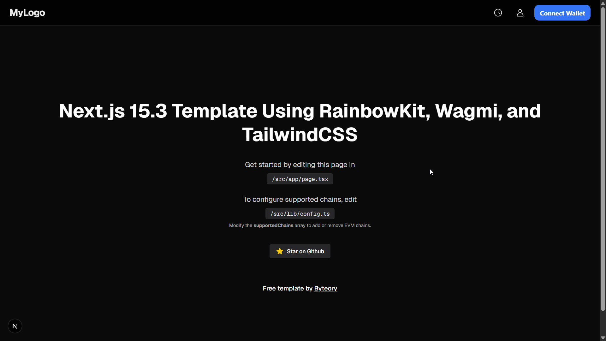

# 🧪 Next.js 15.3 Web3 Starter Template

A sleek starter template built with **Next.js 15.3**, **RainbowKit**, **Wagmi**, **Tailwind CSS**, and **Shadcn UI** — ideal for modern Web3 dApps.

> 🔥 Perfect for wallet connection, EVM chain support, and rapid UI customization.

🖼️ Preview



---

## 🚀 Tech Stack

- **Next.js 15.3 (App Router)**
- **RainbowKit** – Wallet connect modal
- **Wagmi + Viem** – Web3 hooks
- **Tailwind CSS** – Utility-first styling
- **Shadcn UI** – Accessible components
- **TypeScript** – For type safety

---

## 📂 File Structure

src/
├─ app/ → App Router structure
│ └─ page.tsx → Main UI page
├─ lib/
│ └─ config.ts → Configure supported chains here
├─ components/ → Add your UI components here

---

## 🔧 Configuration

### Environment Variables

Create a `.env` file in the root directory with the following:

```env
NEXT_PUBLIC_WALLETCONNECT_PROJECT_ID=cca20e670407e86f62b14688e74a1be3
```

### WalletConnect Verification

The template includes WalletConnect verification. The verification file is located at:

```
public/.well-known/walletconnect.txt
```

This file contains the verification code from cloud.reown.com and is required for WalletConnect to work properly.

### Supported Chains

To modify supported chains:

```ts
// src/lib/config.ts

export const supportedChains = [
  mainnet,
  polygon,
  arbitrum,
  base,
];
```

To start customizing, edit:

/src/app/page.tsx

---

💡 **Features**
- Wallet connection (MetaMask, WalletConnect, etc.)
- Clean, dark theme-ready layout
- Easily extendable for any Web3 use case

---

📦 **Getting Started**

```bash
npm install
# or
yarn install

npm run dev
# or
yarn dev
```

---

⭐ **Credits**
Free template by [Byteory](https://byteory.com)

Don't forget to 🌟 the repo if you found it useful!

---

📜 **License**
MIT — free to use and modify.
